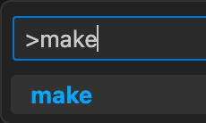
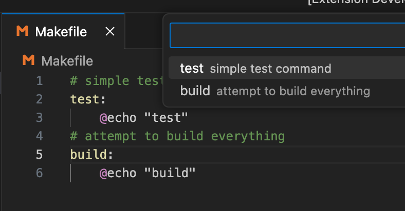

# Make Magic

Make Magic is an extension to simplify running make commands. It adds your Makefile commands to the command palette under the `make` command.

## Features

Selecting the `make` command palette:

Will show a list of Makfile commands:

On selection, your active terminal (or a new one) runs the selected command.

## Requirements

A Makefile must be in the your workspace folder root, named either Makefile or makefile.

Note that a comment must be right before the command for make magic to pick it up as a description, (.PHONY can be declared between comment and command, however)

## Release Notes

### 0.0.2

Add (none) option on make command palette when no Makefile exists, or an no entry Makefile is detected

### 0.0.1

Initial release of make-magic